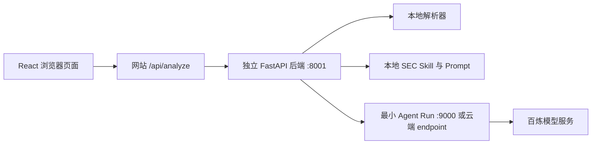

# 财务披露质询分析

用户上传 PDF、Word、Excel 或 CSV 财务披露文件，系统根据所选监管市场生成约 10 个潜在问询问题。结果页左侧展示原始损益表、右侧展示问题、文件依据、监管依据和推荐解答，两栏可独立滚动；下载的横向 PDF 也按“左表右问”逐页排版。

当前状态：

- SEC：已接入本地 Skill，可以测试。
- 联交所：前端展示但禁用；后端也会拒绝 HKEX 请求。
- 本地默认使用 Mock 分析，因此没有阿里云凭证也能测试完整上传流程。
- 切换到 `agentrun` 模式后，独立 Python 后端会调用最小 Agent Run。

## 项目结构

```text
inquiry-analysis/
├── agentrun-agent/                 # 上传 Agent Run 的源码
│   ├── main.py
│   ├── requirements.txt
│   └── system_prompt.py
├── backend/                        # 独立 FastAPI 业务后端
│   ├── app/
│   │   ├── main.py
│   │   ├── review_agent.py
│   │   ├── schemas.py
│   │   └── parsers/
│   ├── prompts/
│   ├── skills/
│   │   └── sec-review.md
│   └── tests/
├── web/                            # React 网站及同源安全代理
├── scripts/
│   └── build-agentrun-zip.sh
```



## 最快本地测试：不连接阿里云

### 1. 首次创建 Conda 环境

打开终端并执行：

```bash
cd /Users/yixuanma/Desktop/EY/inquiry-analysis
conda env create -f environment.yml
conda activate inquiry-analysis
npm --prefix web install
```

以后重新打开终端时不需要再次创建，只要执行：

```bash
conda activate inquiry-analysis
```

激活后可以核对当前工具是否来自该环境：

```bash
which python
python --version
which node
node --version
```

预期路径都以 `/opt/anaconda3/envs/inquiry-analysis/` 开头，Python 为 3.12，Node.js 为 22 或更高。如果 `which node` 仍指向 `.nvm` 中的 Node 20，执行：

```bash
export PATH="$CONDA_PREFIX/bin:$PATH"
hash -r
```

如果 `environment.yml` 或依赖清单以后有更新，执行：

```bash
conda env update -n inquiry-analysis -f environment.yml --prune
```

这个 Conda 环境同时包含 Python 3.12、pip、Node.js 22 和本项目的 Python 依赖，因此不再使用 `.venv` 或 `nvm`。

### 2. 启动 Python 后端

打开第一个终端：

```bash
cd /Users/yixuanma/Desktop/EY/inquiry-analysis/backend
conda activate inquiry-analysis
set -a
source .env
set +a
python app/main.py
```

默认 `.env` 已设置 `ANALYSIS_MODE=mock`，后端地址是 `http://127.0.0.1:8001`。当前使用 8001 是因为电脑上的旧开发进程已经占用了 8000。检查：

```bash
curl http://127.0.0.1:8001/health
```

### 3. 启动 React

打开第二个终端：

```bash
cd /Users/yixuanma/Desktop/EY/inquiry-analysis/web
conda activate inquiry-analysis
../scripts/start-web.sh
```

前端要求 Node.js 22.13 或更高；该版本由 `environment.yml` 安装到同一个 Conda 环境中。`start-web.sh` 会保证使用 Conda 中的 Node 22，避免电脑原先的 `.nvm` Node 20 抢在前面。

打开 `http://localhost:3001/`，上传一个 CSV、PDF、DOCX、XLSX 或 XLS 文件。Mock 结果会明确标记为测试数据，但文件解析、接口、折叠问题和展开依据都是真实运行的。

## 本地连接最小 Agent Run

### 1. 准备 Agent 环境变量

```bash
cd /Users/yixuanma/Desktop/EY/inquiry-analysis
cp agentrun-agent.env.example agentrun-agent.env
```

在 `agentrun-agent.env` 填写 Agent Run 控制台中的 `MODEL_SERVICE_NAME`，以及本机调用该模型服务需要的阿里云凭证。该文件不能上传或提交。

### 2. 安装并启动最小 Agent

打开第三个终端：

```bash
cd /Users/yixuanma/Desktop/EY/inquiry-analysis/agentrun-agent
conda activate inquiry-analysis
set -a
source ../agentrun-agent.env
set +a
python main.py
```

这里本地开发使用 Conda 环境中的 Python 3.12；手工上传 ZIP 则由后面的 Docker 脚本统一构建 Python 3.10 Linux 依赖，两套依赖不能互相复制。

服务默认运行在 `http://127.0.0.1:9000`。检查：

```bash
curl http://127.0.0.1:9000/health
```

### 3. 让业务后端调用它

修改 `backend/.env`：

```dotenv
ANALYSIS_MODE=agentrun
AGENTRUN_CHAT_COMPLETIONS_URL=http://127.0.0.1:9000/openai/v1/chat/completions
AGENTRUN_API_KEY=
```

重启 `backend/app/main.py`。React 不需要修改。

## 打包并上传 Agent Run

源目录始终只有三个文件。手工 ZIP 需要额外包含目标 Linux/Python 环境的第三方依赖，因此构建产物会自动增加 `python/`：

```bash
cd /Users/yixuanma/Desktop/EY/inquiry-analysis
chmod +x scripts/build-agentrun-zip.sh
./scripts/build-agentrun-zip.sh
```

脚本固定使用与 Agent Run Python 3.10 运行时一致的 Debian 10 / GLIBC 2.28
构建环境；不要改用滚动更新的 `python:3.10-slim`，否则原生依赖可能要求云端
不存在的更高 GLIBC 版本。若 Docker Hub 连接失败，脚本会自动切换到 AWS
Public ECR 上的同版本官方镜像副本。构建时还会在 Debian 10 中执行依赖导入检查。

产物：

```text
dist/agentrun-agent-python310-linux-amd64.zip
├── main.py
├── requirements.txt
├── system_prompt.py
└── python/
```

在 Agent Run 控制台上传 ZIP 时：

- 运行时：Python 3.10；
- 启动命令：`python3 main.py`；
- 端口：`9000`；
- 健康检查：`/health`；
- 环境变量：`MODEL_SERVICE_NAME`、可选 `MODEL_NAME`、`AGENT_PORT=9000`；
- 不上传任何 `.env`、Skill、业务 Prompt、用户文件或 React 文件。

发布 endpoint 后，把控制台给出的完整 OpenAI-compatible chat URL 和凭证写入 `backend/.env`：

```dotenv
ANALYSIS_MODE=agentrun
AGENTRUN_CHAT_COMPLETIONS_URL=https://你的完整调用地址
AGENTRUN_API_KEY=你的endpoint凭证
AGENTRUN_AUTH_HEADER=X-API-Key
AGENTRUN_AUTH_SCHEME=
```

上述默认配置会发送 `X-API-Key: <凭证>`。如果控制台生成的调用示例明确使用
`Authorization: Bearer <凭证>`，则改为：

```dotenv
AGENTRUN_AUTH_HEADER=Authorization
AGENTRUN_AUTH_SCHEME=Bearer
```

此后修改 `backend/skills/sec-review.md`、`backend/prompts/system.md` 或其他业务 Prompt，只需重启/部署独立后端，不需要重新上传 Agent Run ZIP。

## 自动化检查

```bash
cd /Users/yixuanma/Desktop/EY/inquiry-analysis/backend
conda activate inquiry-analysis
python -m pytest -q

cd /Users/yixuanma/Desktop/EY/inquiry-analysis/web
npm test
```

也可以在项目根目录一次执行全部检查：

```bash
conda activate inquiry-analysis
./scripts/test-local.sh
```
